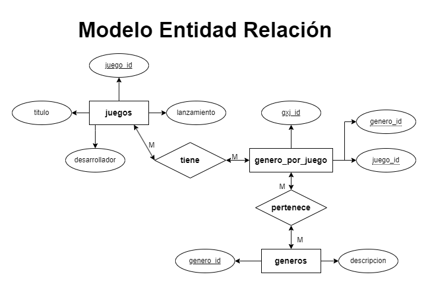
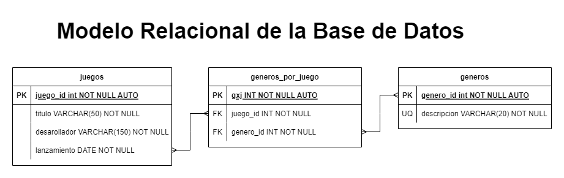

# Sistema de Juegos

## Listado de Entidades

### juegos **(ED)**

- juego_id **(PK)**
- titulo
- desarrollador
- lanzamiento

### generos **(EC)**

- genero_id **(PK)**
- descripcion **(UQ)**

### generos_por_juego **(EP)**

- gxj_id **(PK)**
- juego_id **(FK)**
- genero_id **(FK)**

## Relaciones

1.  **juegos** tiene **generos** (_M a M_).

## Diagramas

### Modelo Entidad - Relación

### Modelo Relacional de la BD

## Reglas de Negocio

### juegos

1. Crear el registro de un juego
1. Leer todos los juegos.
1. Leer un juego en particular.
1. Actualizar los datos de un juego.
1. Eliminar los datos de un juego.

### generos

1. Crear el registro de un genero
1. Leer todos los generos.
1. Leer un genero en particular.
1. Actualizar los datos de un genero.
1. Eliminar los datos de un genero.

### generos_por_juego

1. Crear un genero por juego.
1. Leer todos los generos de un juego.
1. Eliminar un genero por juego.
